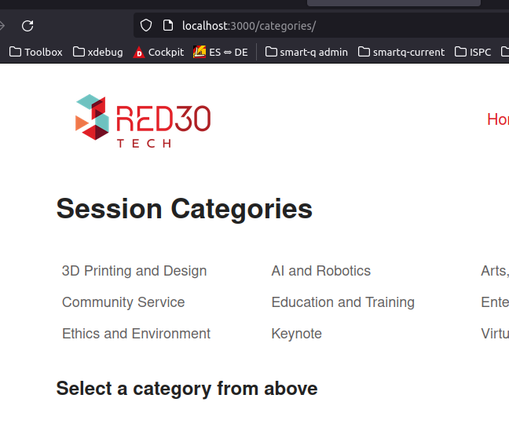

 # Building moder uis with react router 6
 
## Basics

Routing (in single page application context) is the process of navigating users between different parts (screens) of an application when they visit a specific URL.

Routing keeps track of the browser history (so forward / back buttons can be used) and allow for reload while still keeping the app in sync with the URL and hadnle redirection.

React router 6 is currently the standard routing solution for react.

[React Router v6 documentation](https://reactrouter.com/docs/en/v6)

### Setup

Install with `npm install react-router-dom@6`.

Wrap the App with the `BrowserRouter` to make it available within the app:

index.js

    import React from "react";
    import ReactDOM from "react-dom/client";
    import "./index.css";
    import App from "./components/App";
    import {BrowserRouter} from "react-router-dom";
    
    const root = ReactDOM.createRoot(document.getElementById("root"));
    
    root.render(
        <React.StrictMode>
            <BrowserRouter>
                <App/>
            </BrowserRouter>
        </React.StrictMode>
    );

### Routes

A route instructs react router to create a new route and render specific elements to the page when the browsers URL matches a given path. The components are rendered where the Routes is inserted, so there can be static content like headers and footers around it.

`Route` must be wrapped in `Routes`:

    import logo from "../assets/red30-tech-logo.png";
    import {Routes, Route} from 'react-router-dom';

    
    function App() {
      return (
        

          <header className="container">
            // ...
          </header>
            <Routes>
                <Route path={"/"} element={<Home title={"yay home"}/>}/>
                <Route path={"/hello"} element={<h1>Hello from the router</h1>}/>
            </Routes>
          <footer className="container">
            &copy;2022 | <a href="https://red30tech.com/">Red30 Tech</a>
          </footer>
        

      );
    }

*Note: if Routes is not found by IntelliJ, fix is here: https://stackoverflow.com/questions/70031839/cannot-resolve-symbol-routes* 
    
### Link

The `Link` component changes the URL and navigates to another view without reloading the page. It creates a fully accessible anchor component that can be styles as usual.

    <header className="container">
        // ...
        <nav>
          <Link to={"/categories"}>Categories</Link>
        </nav>
    </header>
    <Routes>
        <Route path={"/"} element={<Home title={"yay home"}/>}/>
        // ...

Using `Link` without a full path (e.g. `categories/${id}`) adds the given path to the current URL.

If clicking on `<Link to={"yay"}>yay!!</Link>` in a component served under `/categories`, the resulting link will be `/categories/yay`.

## Nested routes and URL parameters

### Outlet / nested routes

Routes can be nested:

        <Route path={"/categories"} element={<Categories/>}>
            <Route path={"category"} element={<Category/>}/>
        </Route>

Omitting the `/` indicates to the router that the path is relative to the enclosing route.

Nested routes can be used to persist layouts. For the `Category` component to appear inside the `Categories` component, we must indicate to the router where to render it inside `Categories` using `<Outlet />`:

Categories.js

import {Outlet} from "react-router-dom";

    export default function Categories() {
        const categories = getCategories();
    
        return (
            

                <h1>Session Categories</h1>
                    // ...
                </ul>
                <Outlet />
            

        );
    }

The nested component (here: `Category`) will then be rendered where `Outlet is used`

### 404 / no match route

Put a catch-all route after all other routes:

`<Route path={"*"} element={<h1>404 Not found</h1>}/>`

### Placeholders for dynamic routes

URL parameters act as placeholders that match a specific portion of the URL using a colon:

        <Route path={"/categories"} element={<Categories/>}>
            <Route path={":catId"} element={<Category/>}/>
        </Route>

or

        <Route path={"/categories/:catId"} element={<Category/>}>

### Read and display URL parameters

In `Category`, we can now read the placeholder value - the category id - using the `useParams` hook.

`useParams` returns an object with the placeholder names as keys and the actual URL parameter / text as values.

    const params = useParams();
    const category = getCategory(params.catId);

*typescript usage note*:

    type paramType = {
      catId: string;
    };
    
    const { catId } = useParams<paramType>();

### Displaying active links / NavLink

Using `NavLink` instead of `Link` allows to change the appearance of links when they're active (and other styling options).

Using inline styles:

    <NavLink to={cat.id}
             style={({isActive}) => ({
                 color: isActive ? "red" : "blue"
             })}>{cat.name} </NavLink>

Using classNames: 

    <NavLink to={cat.id}
             className={({isActive}) => isActive ? 'category-active' : ''}>{cat.name} </NavLink>

Using a predefined function:

    const addClassIfActive = ({isActive}) => isActive ? 'nav-active': '';
    return (
      // ...
          <nav>
              <NavLink to={"/"} className={addClassIfActive}>Home</NavLink>
              <NavLink to={"/categories"} className={addClassIfActive}>Categories</NavLink>
              <NavLink to={"/about"} className={addClassIfActive}>About</NavLink>

### Index routes

An index route is a child route that doesn't have a path and sets the default element to be rendered in `Outlet` when no sub-route matches:

    <Route path={"/categories"} element={<Categories/>}>
        <Route path={":catId"} element={<Category/>}>
            <Route path={":sessionId"} element={<Session/>}/>
        </Route>
        <Route index element={<h3>Select a category from above</h3>} />
    </Route>

Result: default is rendered under /categories without a category id:

### Navigating programmatically / useNavigate

Simple:

    const navigate = useNavigate();
    function handleSubmit(event) {
        event.preventDefault();
        navigate('/confirmed');
    }

For passing data, we can add a state object as a second parameter:

    //...
    navigate('/confirmed', {state: {email: emailRef.current.value});

We can access the data from the state object in the `Confirmation` component served under `/confirmed` using `useLocation`, which returns a location object containing information about the current url:

Confirmation.js

    export default function Confirmation() {
        const loc = useLocation();
        console.log(loc);
        return (
            

            //...

log:

    {
      "pathname": "/confirmed",
      "search": "",
      "hash": "",
      "state": {
        "email": "a@bc.de"
      },
      "key": "ot9a8u1d"
    }

Destructured and checking if url wasn't called "by hand":

    const {state} = useLocation();
    return (
        

            <h1>Thank You, {state && state.email}!</h1>

*Typescript*: 

    // ...
    import { Location } from "history";
    import { useLocation } from "react-router-dom";
    // ...
        const location = useLocation<Location>();
        const { email } = location.state || { email: "some default value" };
        // ...

or

    let email = location.state?.email?.pathname || "some default value"; 
